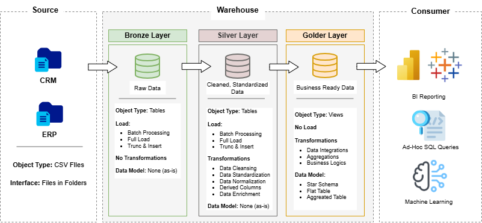

# **SQL Data Warehouse Project**

The purpose of this project is to design and build a medallion (three-tier) data warehouse architecture using Microsoft SQL Server. The project includes ETL development, data modeling, and analytics.

Throughout the development process, the focus was on creating a professional, practical, and easy-to-understand solution suitable for real-world deployment. Each stage of the ETL workflow was carefully analyzed, and all necessary steps—such as validation, transformation, and loading—were explicitly implemented in SQL code. In addition, attention was given to small but important details, such as applying meaningful and consistent naming conventions across the entire warehouse.

---

# **Data Architecture**

This project uses the medallion architecture because it provides a simple, easy-to-manage, and efficient structure—especially suitable for small to medium-sized datasets. The diagram below illustrates the high-level data flow through the warehouse.

### **Components**

#### **Source**
There are two CSV-based source systems: **CRM** (Customer Relationship Management) contains customer and sales-related information, and **ERP** (Enterprise Resource Planning) contains operational, product, and transactional data.

#### **Warehouse**

- **Bronze Layer:**  
  The raw ingestion layer. Data from the source files is loaded directly into SQL tables with minimal transformation. This layer preserves data fidelity and serves as the foundation for downstream processing.

- **Silver Layer:**  
  The refinement layer. This is where the majority of data cleaning, standardization, normalization, and transformation occurs. The goal is to produce clean, reliable, and analytics-ready datasets. Data quality rules, deduplication, type corrections, and business logic are implemented here.

- **Golden Layer:**  
  The business-level presentation layer. Data is modeled into star schemas or subject-specific marts optimized for reporting and analytics. This layer contains fact and dimension tables designed to support BI dashboards, KPIs, and decision-making processes.

---

## Acknowledgments

I would like to thank [**DataWithBaraa**](https://github.com/DataWithBaraa) for everything I learned through this project. He provided an open-source dataset and shared concise, practical insights based on his experience. I highly recommend checking out his website for continuous learning and valuable resources in the IT world.
